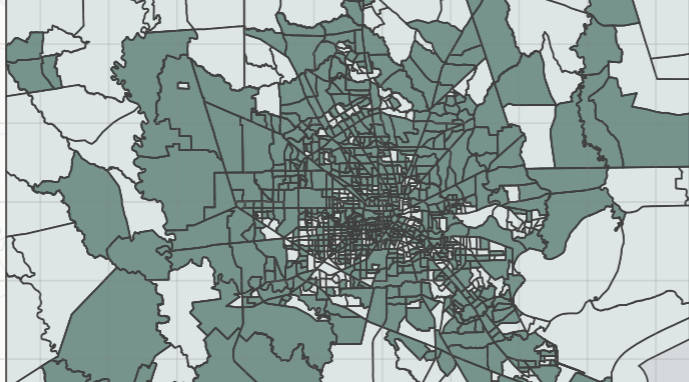

# Winter Storm Impact on Houston Power Outages

{width="445"}

Author: Ava Robillard

This repository contains a Quarto document with an analysis of the power outages in the Houston, Texas area and any disproportionate impacts resulting from a series of severe winter storms in February of 2021.

The project aims specifically to use remotely-sensed night lights data from the Visible Infrared Imaging Radiometer Suite (VIIRS), building and road data from OpenStreetMap (OSM), and socioeconomic data from the U.S. Census Bureau to visualize how many homes lost power post-storm and how these blackouts relate to median household income in Houston, Texas.

## Repository Structure

The **houston-stormimpact.qmd** file contains the main analysis and visualizations.

The **data** folder contains the VIIRS, OpenStreetMap, and U.S. Census data imported for the analysis.

``` bash
houston-stormimpact
└───README.md
└───houston-stormimpact.Rproj    
└───houston-stormimpact.qmd 
└───.gitignore
    └───data
        └───gis_osm_buildings_a_free_1.gpkg
        └───gis_osm_roads_free_1.gpkg
        └───ACS_2019_5YR_TRACT_48_TEXAS.gdb
            └───census tract gdb files
        └───VNP46A1
            └───VIIRS data files
```

## Data

The VIIRS data used for visualizing the extent of power outages around the day of the storm is distributed through [NASA's Level-1 and Atmospheric Archive & Distribution System Distributed Active Archive Center (LAADS DAAC)](https://ladsweb.modaps.eosdis.nasa.gov/). Two 10x10 degree tiles per date of interest were used for this analysis.

The road and house data was obtained from [OpenStreetMap (OSM)](https://planet.openstreetmap.org/), a collaborative project which creates publicly available geographic data. The shapefiles were retrieved from [Geofabrik's download sites](https://download.geofabrik.de/) and then filtered to a Geopackage (.gpkg) file containing just the subset of features that intersect the Houston metropolitan area.

The socioeconomic data for 2019 census tracts was obtained from the [U.S Census Bureau's American Community Survey](https://www.census.gov/programs-surveys/acs), which collects detailed social, economic, housing, and demographic information from households across the US.

## References

This assignment was created as a part of EDS 223: Geospatial Analysis & Remote Sensing, taught by Annie Adams.

**Data**

[VIIRS](https://ladsweb.modaps.eosdis.nasa.gov/). Accessed Oct 30, 2025

[OpenStreetMap Geofabrik download](https://download.geofabrik.de/). Accessed Oct 30, 2025

[U.S Census Bureau's American Community Survey](https://www.census.gov/programs-surveys/acs). Accessed Oct 30, 2025
